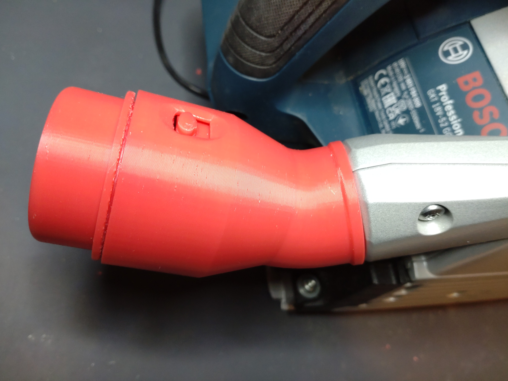
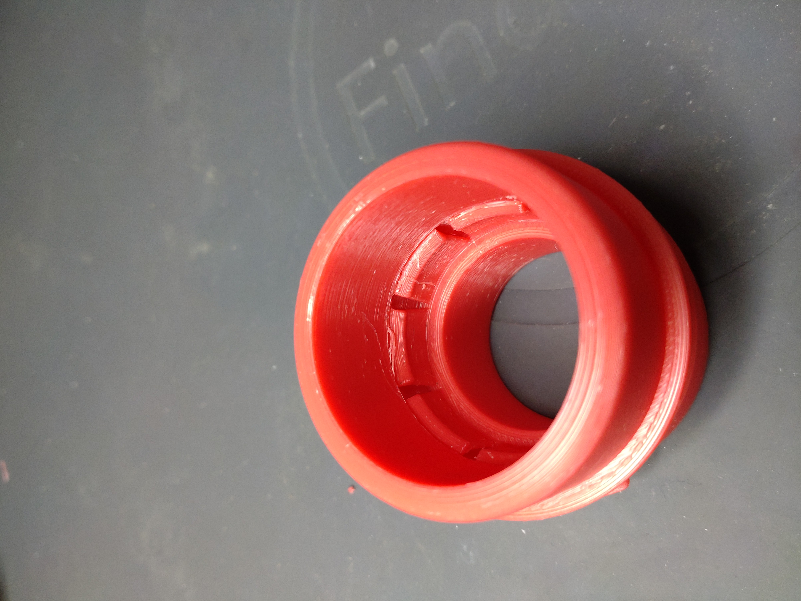
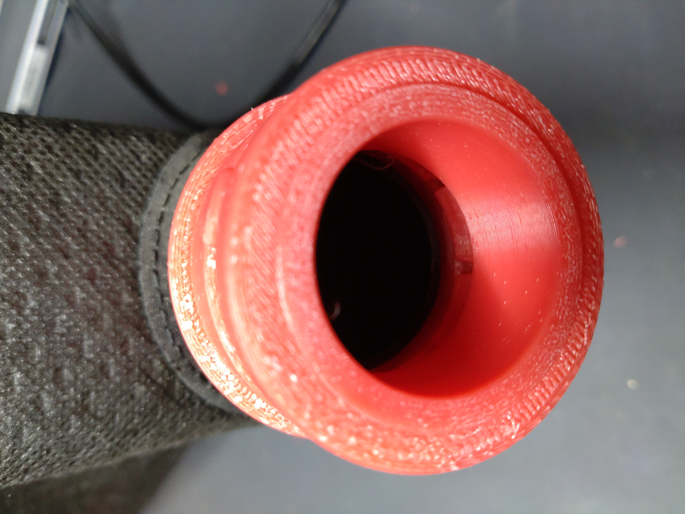
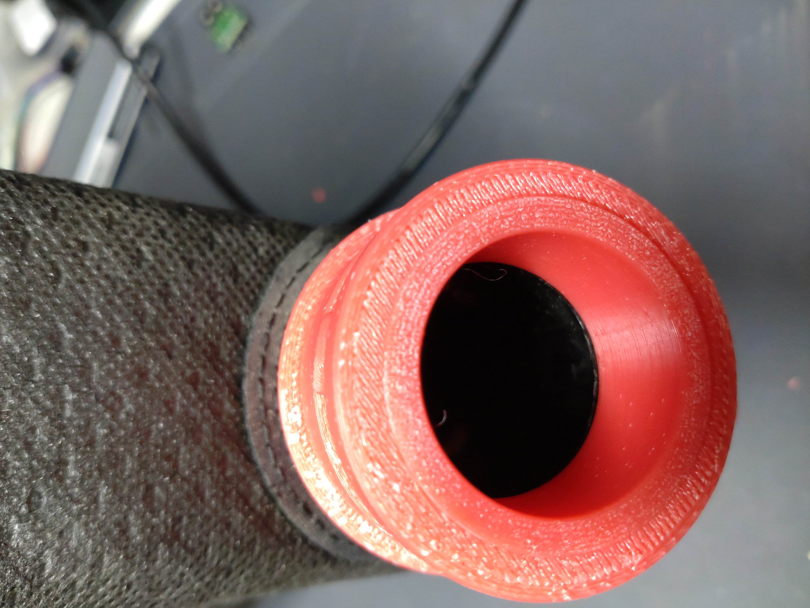
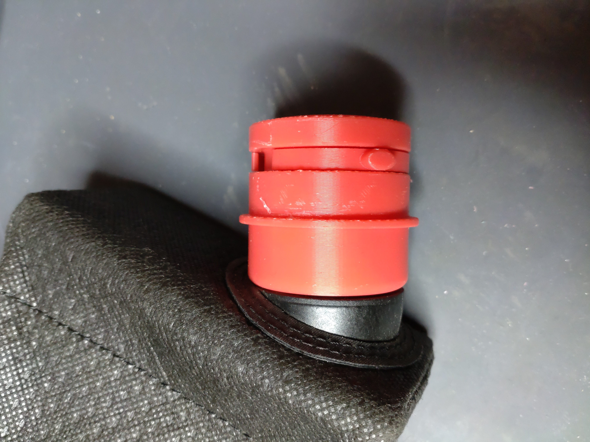
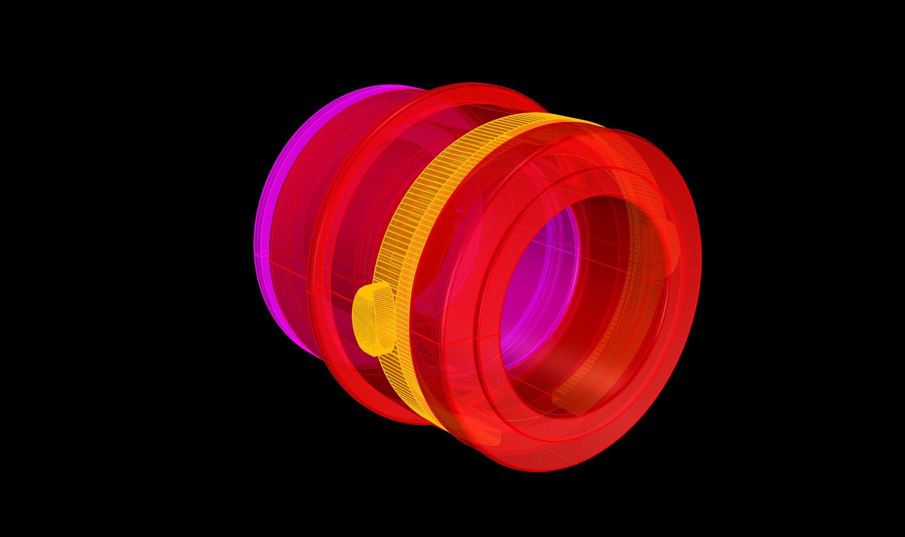
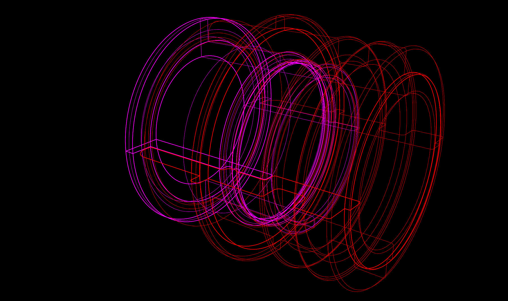
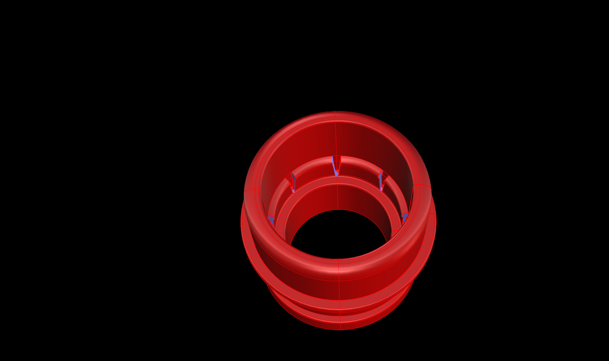
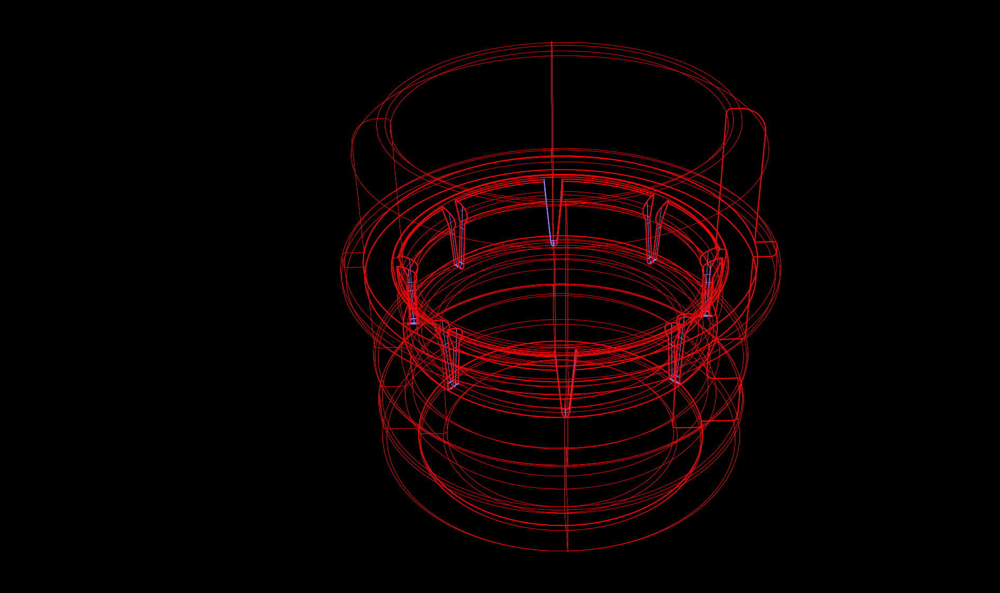

# Bosch-GKT-18V-52-GC-dust-bag-adapter-
3D printable adapter to connect the original dust bag on a click&amp;clean adapter on the Bosch GKT 18V 52 GC plunge saw. Created with Rhino 8.

I recently bought this Bosch plunge saw together with a Bosch GAS 18V L vaccum cleaner. 
To connect the vaccum cleaner, an adapter for the click&clean system is needed. 
Once this click&clean adapter is mounted to the plunge saw, you no longer can connect the original dust bag to the plunge saw.
I designed this additional adapter to connect the dust bag to the click&clean adapter.

Have a look in my repos. There is also a dust cover for the hole on the side.

Requirements:
* 3D printer 
* Filament of your choice (I use PETG)
  
## View

 

  

 
 
 

